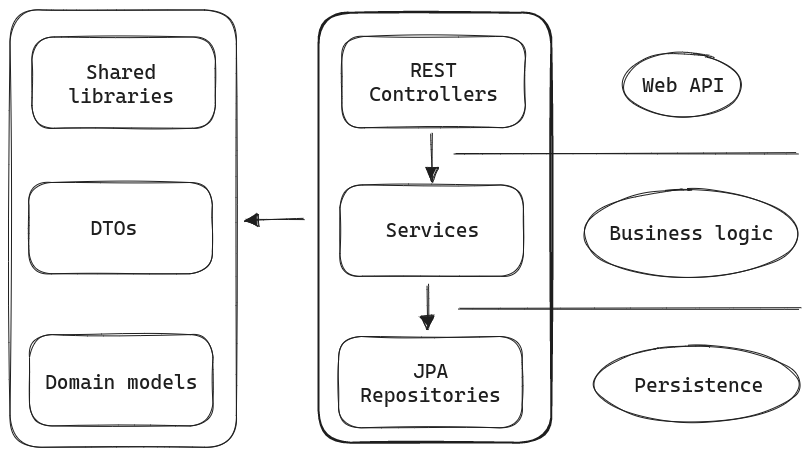

# Demo spring-boot maven application

---

## Description

Java spring-boot application, written to level up knowledge of maven build tool, spring boot, and some libraries.
It is a back-end part of the abstract Museum Website and provides REST endpoints with basic CRUD functionality.

---

## App Architecture

> The project has basic 'onion' or three-layer architecture.

 

---

## Project structure

```bash
                  on 2023-08-18
.
├── docker-compose.yml
├── Dockerfile
├── domain
│   ├── domain.iml
│   └── target
│       ├── classes
│       ├── generated-sources
│       │   └── annotations
│       ├── generated-test-sources
│       │   └── test-annotations
│       └── test-classes
├── mvnw
├── mvnw.cmd
├── pom.xml
├── Project-simple-diagram.png
├── README.md
└── src
    ├── main
    │   ├── java
    │   │   └── com
    │   │       └── example
    │   │           ├── Application.java
    │   │           ├── constants
    │   │           │   └── TestConstants.java
    │   │           ├── constraints
    │   │           │   ├── museum
    │   │           │   │   ├── ArticleConstraints.java
    │   │           │   │   ├── AuthorConstraints.java
    │   │           │   │   └── EventConstraints.java
    │   │           │   ├── SharedConstraints.java
    │   │           │   └── users
    │   │           │       └── UserConstraints.java
    │   │           ├── domain
    │   │           │   ├── museum
    │   │           │   │   ├── Article.java
    │   │           │   │   ├── Author.java
    │   │           │   │   └── Event.java
    │   │           │   └── users
    │   │           │       └── User.java
    │   │           ├── dto
    │   │           │   ├── museum
    │   │           │   │   ├── article
    │   │           │   │   │   ├── ArticlePublishingForm.java
    │   │           │   │   │   ├── ArticleWithContent.java
    │   │           │   │   │   └── ArticleWithoutContent.java
    │   │           │   │   ├── author
    │   │           │   │   │   ├── AuthorRegistrationForm.java
    │   │           │   │   │   └── AuthorShortResponse.java
    │   │           │   │   └── event
    │   │           │   │       ├── EventPublishingForm.java
    │   │           │   │       ├── EventWithContent.java
    │   │           │   │       └── EventWithoutContent.java
    │   │           │   └── users
    │   │           │       ├── UserRegistrationForm.java
    │   │           │       └── UserResponse.java
    │   │           ├── repositories
    │   │           │   ├── museum
    │   │           │   │   ├── ArticleRepository.java
    │   │           │   │   ├── AuthorRepository.java
    │   │           │   │   └── EventRepository.java
    │   │           │   └── users
    │   │           │       └── UserRepository.java
    │   │           ├── services
    │   │           │   ├── museum
    │   │           │   │   ├── ArticleService.java
    │   │           │   │   ├── AuthorService.java
    │   │           │   │   ├── EventService.java
    │   │           │   │   ├── exceptions
    │   │           │   │   │   ├── ArticleNotFoundException.java
    │   │           │   │   │   ├── AuthorAlreadyExistException.java
    │   │           │   │   │   ├── AuthorNotFoundException.java
    │   │           │   │   │   └── EventNotFoundException.java
    │   │           │   │   └── impl
    │   │           │   │       ├── ArticleServiceImpl.java
    │   │           │   │       ├── AuthorServiceImpl.java
    │   │           │   │       └── EventServiceImpl.java
    │   │           │   └── users
    │   │           │       ├── exceptions
    │   │           │       │   ├── UserAlreadyExistsException.java
    │   │           │       │   └── UserNotFoundException.java
    │   │           │       ├── impl
    │   │           │       │   └── UserServiceImpl.java
    │   │           │       └── UserService.java
    │   │           └── web
    │   │               ├── exceptionhandler
    │   │               │   └── RestExceptionHandler.java
    │   │               ├── museum
    │   │               │   └── controllers
    │   │               │       ├── ArticleController.java
    │   │               │       ├── AuthorController.java
    │   │               │       └── EventController.java
    │   │               └── users
    │   │                   └── UserController.java
    │   └── resources
    │       ├── application.yml
    │       └── db
    │           └── migration
    │               ├── V1__initial_schema.sql
    │               └── V2__fake_data.sql
    └── test
        ├── java
        │   └── com
        │       └── example
        │           ├── config
        │           │   ├── AbstractInstancioDomainTest.java
        │           │   ├── AbstractInstancioTest.java
        │           │   ├── AbstractRepositoryIntegrationTest.java
        │           │   └── AbstractServiceIntegrationTest.java
        │           ├── domain
        │           │   ├── museum
        │           │   │   ├── ArticleTest.java
        │           │   │   ├── AuthorTest.java
        │           │   │   └── EventTest.java
        │           │   └── users
        │           │       └── UserTest.java
        │           ├── dto
        │           │   ├── museum
        │           │   │   ├── article
        │           │   │   │   ├── ArticlePublishingFormTest.java
        │           │   │   │   ├── ArticleWithContentTest.java
        │           │   │   │   └── ArticleWithoutContentTest.java
        │           │   │   ├── author
        │           │   │   │   ├── AuthorRegistrationFormInstancioTest.java
        │           │   │   │   └── AuthorShortResponseInstancioTest.java
        │           │   │   └── event
        │           │   │       └── EventPublishingFormTest.java
        │           │   └── users
        │           │       ├── UserRegistrationFormInstancioTest.java
        │           │       └── UserResponseInstancioTest.java
        │           ├── repositories
        │           │   ├── museum
        │           │   │   ├── ArticleRepositoryIntegrationTest.java
        │           │   │   ├── AuthorRepositoryIntegrationTest.java
        │           │   │   └── EventRepositoryIntegrationTest.java
        │           │   └── users
        │           │       └── UserRepositoryIntegrationTest.java
        │           ├── services
        │           │   ├── museum
        │           │   │   └── impl
        │           │   │       ├── ArticleServiceImplIntegrationTest.java
        │           │   │       ├── AuthorServiceIntegrationTest.java
        │           │   │       └── EventServiceImplIntegrationTest.java
        │           │   └── users
        │           │       └── impl
        │           │           └── UserServiceIntegrationTest.java
        │           └── web
        │               ├── museum
        │               │   └── controllers
        │               │       ├── ArticleControllerTest.java
        │               │       └── EventControllerTest.java
        │               └── users
        │                   └── UserControllerTest.java
        └── resources

```

---

## Features and technology stack

### Main properties

- Language: Java-17
- Build tool: Apache Maven
- Main framework: Spring Boot 3.1.2
- CI: GitHub Actions
- Deployment: Docker with Docker Compose plugin

#### WEB

- [Spring Web](https://spring.io/projects/spring-framework).
  - REST Controllers for endpoints
  - RestControllerAdvice for exception handling
- Swagger ([Springdoc OpenAPI](https://springdoc.org/))
  - Generating openAPI documentation
  - Swagger Web UI by link: [swagger-ui](http://localhost:8080/swagger-ui/index.html)
- [Jackson databind](https://github.com/FasterXML/jackson-databind)

#### Persistence

- [Spring Data JPA](https://spring.io/projects/spring-data-jpa)
  - Hibernate as default ORM framework
  - Records DTO projections for retrieving data
  - Transaction management by spring @Transactional
- [Flyway](https://flywaydb.org/) SQL migration, for managing schemes versions
- [PostgreSQL](https://www.postgresql.org/) as RDBMS

#### Tests

- [JUnit 5](https://junit.org/junit5/docs/current/user-guide/)
- [Mockito](https://site.mockito.org/)
- [Spring Boot Test](https://docs.spring.io/spring-boot/docs/current/api/org/springframework/boot/test/context/SpringBootTest.html)
  - MockMVC for testing API cals
  - SpringBootTest for integration testing
- [Testcontainers](https://testcontainers.com/guides/getting-started-with-testcontainers-for-java/) for integration testing
- [Instancio](https://www.instancio.org/getting-started/) for generating fake test data

#### Other

- [Lombok](https://projectlombok.org/features/)
- Java Bean Validation ([Hibernate Validation](https://hibernate.org/validator/))

### How you can try it

> Now the project is in development, and not everything should work perfectly fine 😊.  
> But I fix all issues as soon as possible 😅.  

__What do you need:__

1. You should have Docker with Docker compose plugin (or Docker desktop) installed on your machine. Link with instructions: [Get Docker](https://docs.docker.com/get-docker/)
2. Java 17 installed. I recommend using [SDK-man](https://sdkman.io/) for this. It is not so easy on Windows, but it is worth it. (Link on GitHub post: [Using SDKMAN! with git for Windows shell (git bash)](https://gist.github.com/gavvvr/7d90014adefa8b27fe3b0e1c2a0e6485#using-sdkman-with-git-for-windows-shell-git-bash)).
3. And that\`s it 😎.

__Installation steps:__

1. Clone this repository.

2. Run another command:

```bash
./mvnw clean install
```

3. Run this command in your terminal (on Linux and Mac), Power-Shell or Git-bash (on Windows), but first of all move to the root of the project:  

```bash
docker compose up -d
```

5. Open link in your browser: [swagger-ui](http://localhost:8080/swagger-ui/index.html)

6. Test endpoints with the Swagger UI 😀
